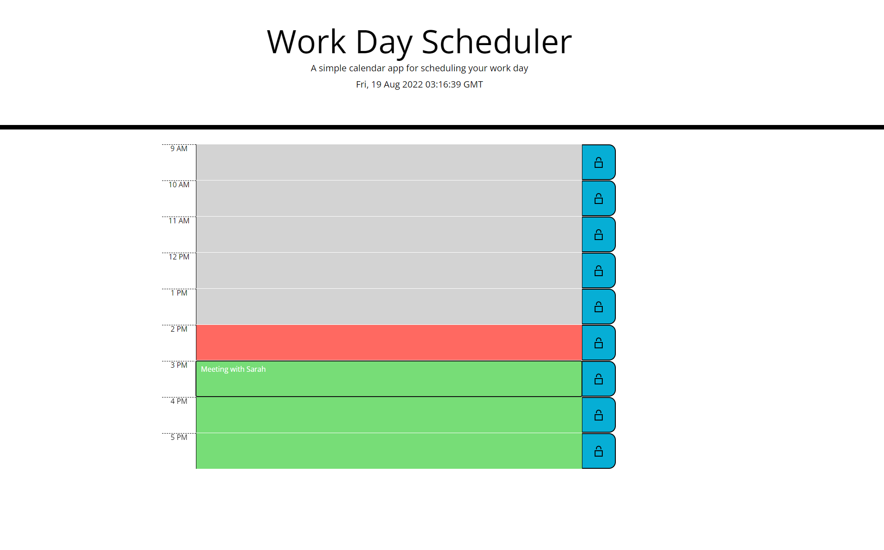

# urban-broccoli : Work-Day Scheduler

## Purpose 

The goal of this project was to use the planned layout and pre-created CSS classes to present the information of a daily work-day planner in an informative and user-friendly layout.

## HTML and CSS

Little work was needed thanks to the existence of pre-planned classes - it was mainly a matter of checking where things were intended to be applied against the mock-up.

## JavaScript

Dayjs API was used for time and date functionality (as an alternative to Moment). By comparing the index location of a given hour row in an array of all such rows we were able to update them to change color based on the current hour.

I continued with this design in mind by using index numbers as keys for saving user input to local storage and replacing it in the correct hour slot.

### Deployed Site

https://shanep42.github.io/urban-broccoli/